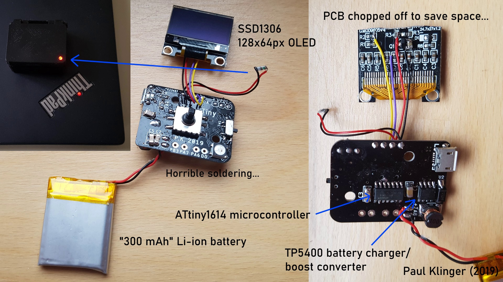

# ThinkTiny — A miniature laptop

Components:
- [ATtiny1614 microcontroller](https://octopart.com/attiny1614-ssfr-microchip-82181131)
- [128x64 OLED screen with SSD1306 driver](https://www.aliexpress.com/item/Free-Shipping-White-Blue-Whiteand-Blue-color-0-96-inch-128X64-OLED-Display-Module-For-arduino/32713614136.html)
- [5 way switch](https://www.aliexpress.com/item/32807613480.html)
- [WS2812B LED](https://www.aliexpress.com/item/100pcs-DC5V-WS2812B-4Pins-5050-SMD-with-Built-in-WS2811-IC-Individually-Addressable-Digital-RGB-LED/32542036874.html)
- [2mm PMMA optic fiber](https://www.aliexpress.com/item/5mX-Transparent-side-glow-plastic-PMMA-fiber-optic-cable-solid-core-optic-cable-diameter-2mm-3mm/32807597828.html)
- [power switch](https://www.aliexpress.com/item/32967873133.html)
- [TP5400 charge controller/boost converter](https://www.aliexpress.com/item/32869425291.html)
- [10uH CD54 inductor](https://www.aliexpress.com/item/32956022325.html)
- [Li-ion battery](https://www.aliexpress.com/item/32954488360.html)
- [SS24 diode](https://www.aliexpress.com/item/32904408053.html)
- [10K/6.8K/1K 0805 resistor](https://www.aliexpress.com/item/32880368264.html)
- [5x 47uf 1206 capacitors](https://www.aliexpress.com/item/32373728015.html)
- [2xred 1xgreen 0805 led](https://www.aliexpress.com/item/32816842323.html)
- [Some 30 AWG wire wire](https://www.aliexpress.com/item/30-AWG-Wrapping-Wire-0-25mm-Tin-Plated-Copper-8-Colored-Wire-Wrap-Insulation-Test-Cable/32907507087.html)

I cut off the top of the OLED PCB with flush cutters to make it fit into the case. That's where the pin header sits, so I needed to tap into the connections somewhere else on the PCB. I've marked the points in [this image](black_oled_pin_connection_points.jpg), but be careful, there might be versions of this display with different layout. I also added a capacitor after the voltage regulator on the display board (the three pin component). This gets rid of flickering when there's a lot of white on the screen.

There's a small piece of fiberoptic in the hole in the display back cover, which transmits and diffuses the light from the red LED. That 0805 LED is directly soldered to an 0805 6.8k resistor and connected back to the main PCB.

The pcb cover ("pcb cover.stl") is printed with a color change: black filament at the bottom (the top when assembled) and then with transparent filament to create the diffuser for the "think" logo and the charging indicator LEDs.

The hole on the top right of the pcb cover is used to reprogram the MCU without dissasembling everything. I use a small jig with three spring loaded pogo pins ([bought here](https://www.aliexpress.com/item/50pcs-set-New-P75-B1-Dia-1-02mm-100g-Cusp-Spear-Spring-Loaded-Test-Probes-Pogo/32767984398.html)) to connect to three pads (for power, ground, and UPDI data) in a piece of protoboard underneath (you need to put some solder in the three holes to make a surface for the pins to push against). The holes are the standard pin header ones, 0.1 inch apart, so you can just solder the pogo pins into three adjacent holes of another protoboard to make a jig. Here's [a picture](https://raw.githubusercontent.com/PaulKlinger/ndice/master/programming_jig.jpg) of the programming jig with a PICkit 4 connected (the PICkit doesn't provide power, so that comes from the usb).